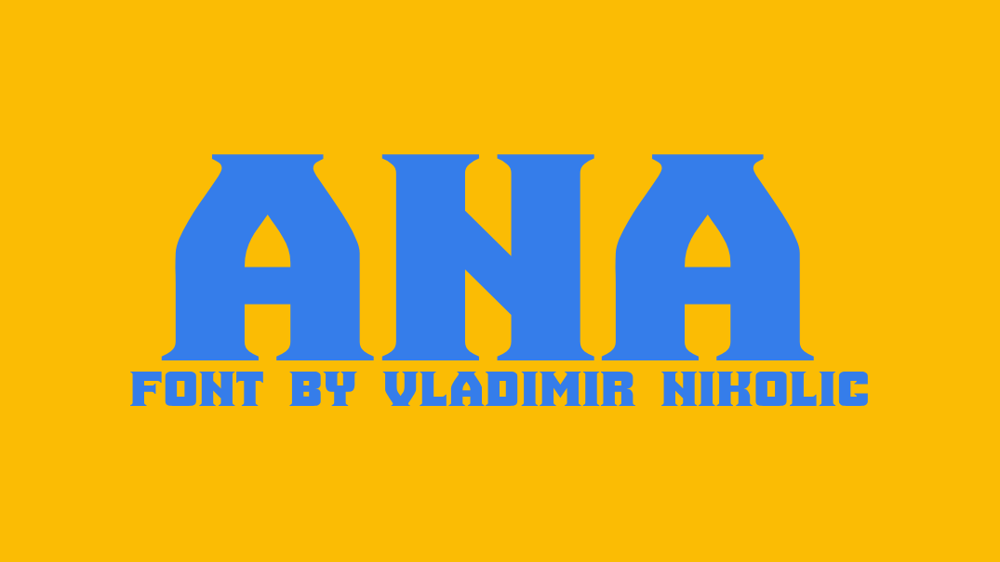

# Ana

In Croatia, the name Ana was the second most common feminine given name, or among the top ten most common, in almost all decades for which there is census data.

## Variable Font Axe
Ana has the following axe:

Axis | Tag | Default | Static Instances
--- | --- | --- | ---
Weight | wght | 400 | Regular

