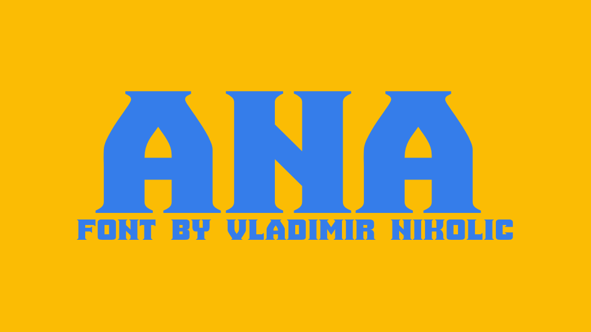

# Ana

Ana (Cyrillic: Ана) is a version of the female given name Anna meaning "favour" or "grace".

## Variable Font Axe
Ana has the following axe:

Axis | Tag | Default | Static Instances
--- | --- | --- | ---
Weight | wght | 400 | Regular

## License

This Font Software is licensed under the OFL-1.1 license
